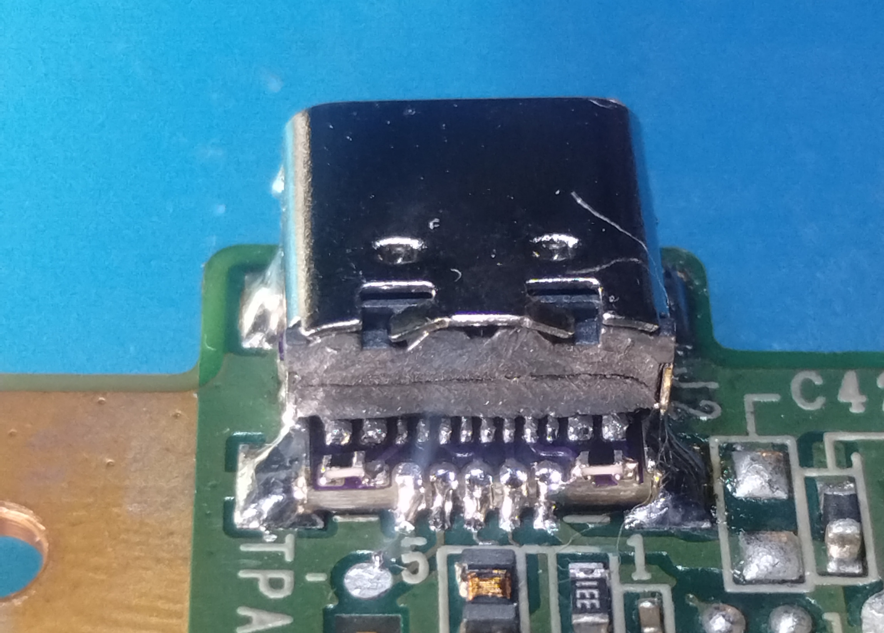

# TascamDR40usbc

This is an adapter PCB that replaces the DR-40's USB mini port with a host charging capable USB C port.

# Why/About

I have done USB C mods to many of the devices I own, and I wanted to make one for my DR-40. This may also work on a DR-40X, but I do not own one to confirm this.

This mod uses 0402 SMD resistors and a small pitched USB C port, so it will require some soldering experience.

# What you'll need

The PCB, of which gerbers are available for in the repo. It has to be 0.8mm thick to stay within the USB mini's original footprint/volume. The PCB can be ordered from any board house, but some may not like the castellated holes on the edges. [Oshpark](https://oshpark.com/#services) will do castellated holes, has 0.8mm availability and is quite cheap, but the finished boards may require post processing with a small knife.

2 0402 4.7k SMD resistors. They can be sourced from anywhere, here are some examples: [Aliexpress](https://www.aliexpress.us/item/2251832778239041.html), [Ebay](https://www.ebay.com/itm/195680390537), [Mouser](https://www.mouser.com/ProductDetail/Samsung-Electro-Mechanics/CL21B105KPFNNNE?qs=349EhDEZ59rb3V94UrmRdQ%3D%3D)

Basic soldering equipment.

Hobby knife.

# Installation

Disassemble and remove the USB mini port from your DR-40. Use solder wick to make the USB mini port's pads flat. 
Touch up the castellated holes of your PCB, as they will most certainly arrive with excess material from the pads being drilled. Seat the USB C port as forward as it will go on the pcb, and solder the front two legs of it to keep it positioned. Next, solder the USB C port's 12 pins. Afterwards, solder the two resistors onto their footprints while being careful to not bridge the resistors and the USB C port. 
Allign the edge of the adapter PCB to the edge of the DR-40's PCB, then solder the USB C port's shield to the 4 shield pads on the DR-40's PCB. Finally, solder the adapter PCBs castellated holes to the old USB data/power lines. 
Remove plastic as shown in the image below from the casing to make room for the USB C port. Reassemble enough to test.

# PCB Images

